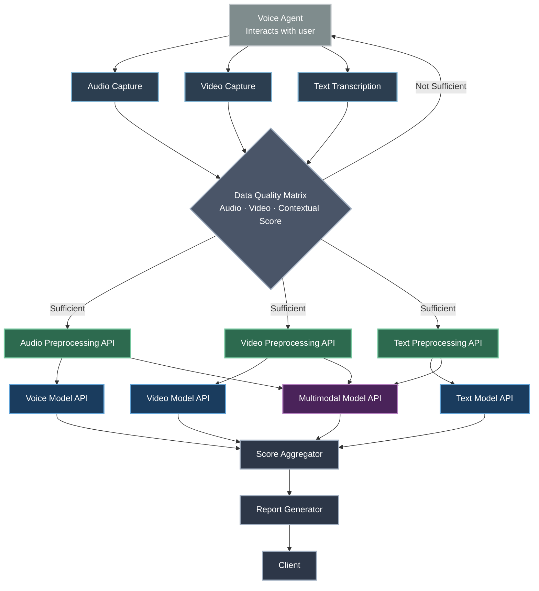

# Mental Health Assessment System — Project Flow

```mermaid
flowchart TD

    A["Voice Agent\nInteracts with user"]

    A --> B["Audio Capture"]
    A --> C["Video Capture"]
    A --> T["Text Transcription"]

    B --> D{"Data Quality Matrix\nAudio · Video · Contextual Score"}
    C --> D
    T --> D

    D -- "Not Sufficient" --> A
    D -- "Sufficient" --> P1
    D -- "Sufficient" --> P2
    D -- "Sufficient" --> P3

    P1["Audio Preprocessing API"]
    P2["Video Preprocessing API"]
    P3["Text Preprocessing API"]

    P1 --> F1["Voice Model API"]
    P2 --> F2["Video Model API"]
    P3 --> F3["Text Model API"]
    P1 --> F4["Multimodal Model API"]
    P2 --> F4
    P3 --> F4

    F1 --> G["Score Aggregator"]
    F2 --> G
    F3 --> G
    F4 --> G

    G --> H["Report Generator"]
    H --> I["Client"]

    classDef capture    fill:#2c3e50,stroke:#7fb3d3,stroke-width:2px,color:#ffffff
    classDef matrix     fill:#4a5568,stroke:#a0aec0,stroke-width:2px,color:#ffffff
    classDef preprocess fill:#2d6a4f,stroke:#74c69d,stroke-width:2px,color:#ffffff
    classDef model      fill:#1a3c5e,stroke:#63a4d8,stroke-width:2px,color:#ffffff
    classDef multimodal fill:#4a235a,stroke:#b47fc0,stroke-width:2px,color:#ffffff
    classDef output     fill:#2d3748,stroke:#a0aec0,stroke-width:2px,color:#ffffff
    classDef agent      fill:#7f8c8d,stroke:#bdc3c7,stroke-width:2px,color:#ffffff

    class A agent
    class B,C,T capture
    class D matrix
    class P1,P2,P3 preprocess
    class F1,F2,F3 model
    class F4 multimodal
    class G,H,I output
```
